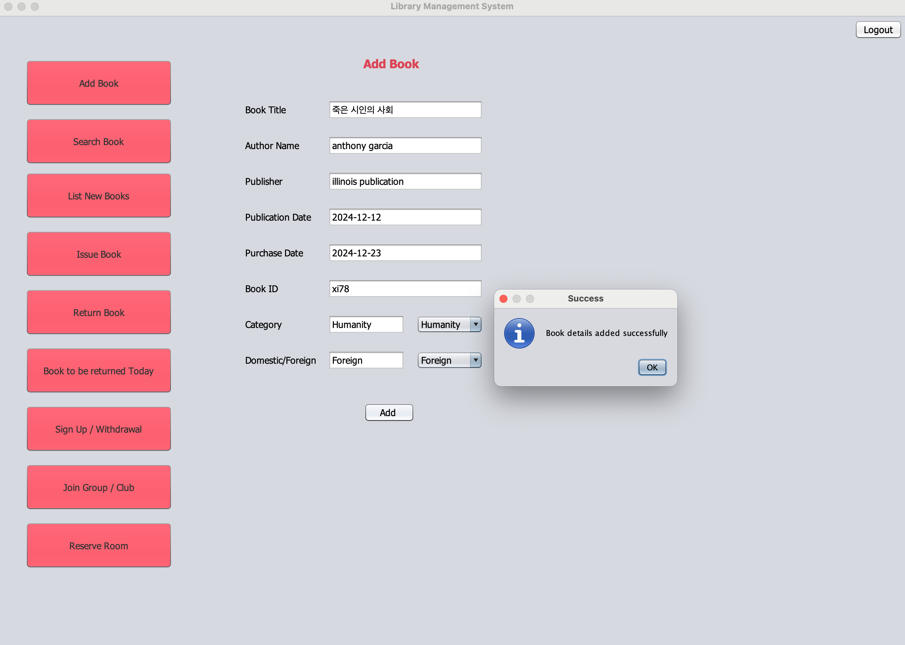
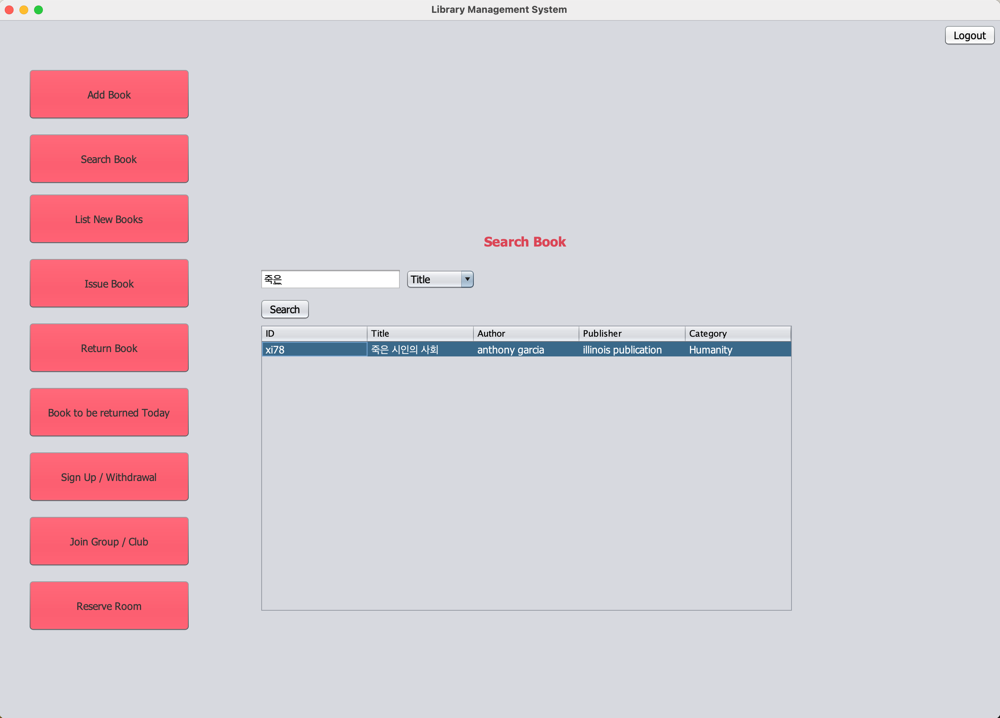
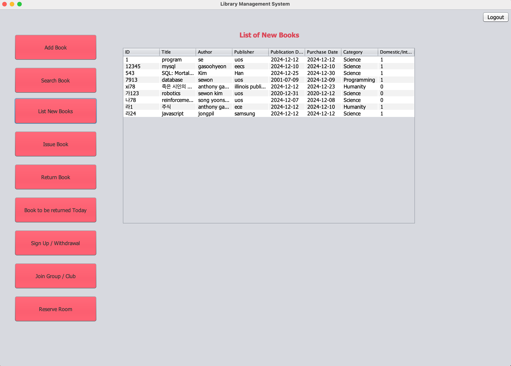
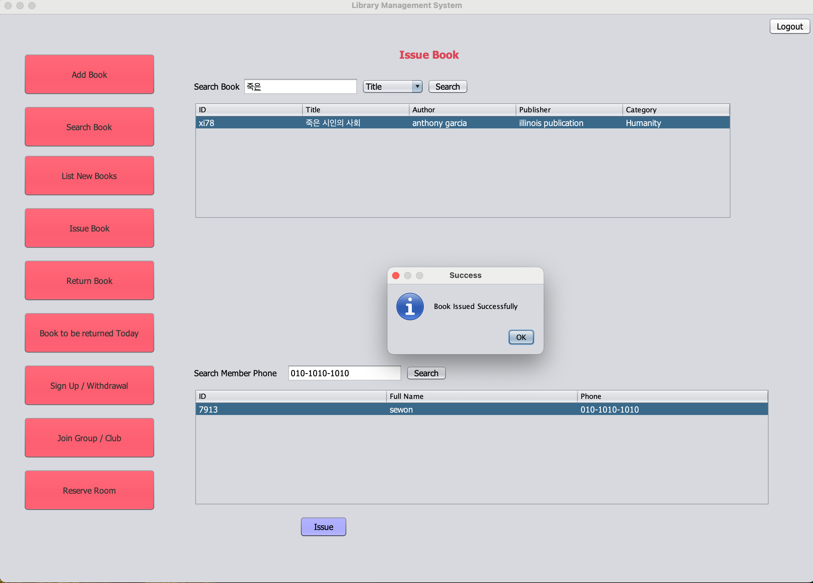
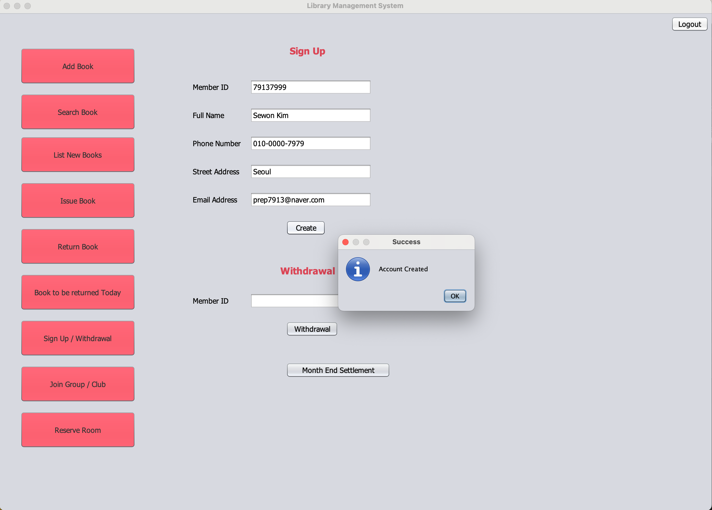

# Library Mangement System








# Getting Started

Contact to MySQL

```bash
mysql -u root -h 127.0.0.1 -p 
Enter password: 

mysql> 

CREATE DATABASE library_management
USE library_management
SOURCE /Users/kevinliam/Desktop/anthony/development/library-management-system/src/database/schema.sql;
```

Make database and tables

```bash
USE [database_name];

SOURCE sales_orders_database.sql
```

Run MainFrame.java

```bash
export PYTHONPATH="/Users/kevinliam/Desktop/anthony/development/library-management-system"

cd /Users/kevinliam/Desktop/anthony/development/java-ui/Library-Management/src
javac com/cruds/gui/MainFrame.java

# build
javac -d . com/cruds/db/*.java com/cruds/model/*.java com/cruds/gui/MainFrame.java

# start
java -cp . com.cruds.gui.MainFrame
```

# Development Specification

우수회원이 되기 위해서는 일 년 안에 대출 횟수가 5권 이상이어야 하고 반납 지체가 6개월 내에 5권을 넘으면 안 된다. 우수회원은 20권까지 책을 대여받을 수 있으며 세미나실 예약에 우선권이 있다. 소모임은 대표자, 회원번호, 나이대를 기록한다. 소모임은 세미나실을 사용할 수 있다. 소모임은 도서 구매를 추천하고 책 구매에 우선권을 가진다. 

주문 도서 도착시 검사가 이루어지고 문제가 없을 시에 관리번호를 부여받고 관리번호와 라벨을 책에 부착한다. 그리고 새 책에 대한 정보를 관리대장에 기록한다. 등록 시에 저자, 출판사, 출판년도를 기록하고 새 책은 한 달 동안 게시판에 올려놓는다. 회원은 회원카드 또는 전화번호를 제시하여 신원확인을 한다. 반납 연체된 책이 있으면 대출은 거부된다. 구매가 5개월 내이면 신규 책으로 분류된다.

도서를 대출하기 위하여 회원가입을 하여야 한다. 회원 가입시에는 이용자 이름, 전화번호, 집주소, 이메일 주소를 입력한다. 회원가입을 하면 회원증이 발급되고 회원카드에 부착된 바코드를 가지고 대출/반납 시에 신분 확인할 수 있다. 회원 가입 즉시 도서를 대출할 수 있다. 회원에게는 자체관리를 위해 회원번호가 부여된다. 일반회원의 대출가능 도서는 5권으로 제한된다. 회원 탈퇴를 하려면 미납도서가 없어야 한다. 회원이 탈퇴하면 회원정보에 탈퇴여부를 기록하고 월말 결산 시 탈퇴한 회원을 일괄정리한다. 탈퇴한 회원이 재가입시에는 최초 가입과 동일한 절차를 거친다. 우수회원의 기준은 다음과 같다: 최근 6개월 간 월 4권 이상 도서를 대출한 실적이 있는 회원으로써 최근 6개월간 대출 기간 내 미반납이 6회 이하인 회원. 우수회원에 대한 특전: 도서 대출 제한 권수를 10권까지 확대한다. 세미나실 예약 시 우선권을 부여한다. 매월 신간도서 목록을 발송한다. 우수회원은 시스템이 자동 분류한다. 매월 결산 시 우수 회원을 재분류한다. 독서클럽 활성화를 위해서 클럽 정보를 관리한다. 클럽 정보에는 클럽명, 대표자, 인원수, 연령대 정보를 저장한다. 도서클럽은 세미나실을 이용할 수 있다. 매월 1회 대표자 회의를 갖는다. 독서클럽 회원들이 추천한 신간도서는 우선적으로 구매한다. 신간도서의 기준은 도서관에서 구매한 날짜가 3개월 이내인 도서를 말한다. 각 고서에 대하여 제목, 저자, 분류가호, 출판사, 국내/해외도서 여부, 출판년도 가터 정보를 등록한다. 도서의 대출기간은 신간도서 7일, 기타 도서는 14일로 한다. 도서의 반납은 회원이 직접 방문하여 반납하거나 무인 반납기를 이용하여 반납한다. 대출 기간이 경과한 도서에 대하여 연체료를 부과한다. 연체료는 하루당 100원이다. 연체료는 도서관장이 필요 시 재설정할 수 있다. 무인 반납기를 이용하여 반납된 도서 중 연체기간이 경과한 것은 다음 대출 때 연체료를 청구한다.

# ERD

```mermaid
erDiagram
    %% 멤버 테이블을 정의합니다.
    members {
        string member_id PK
        string full_name
        string phone_number
        string street_address
        string email_address
        boolean is_vip
        boolean is_withdrawn
    }

    %% 그룹 테이블을 정의합니다.
    groups {
        int group_id PK
        string member_id FK
        string member_age
    }
    
    %% 클럽 테이블을 정의합니다.
    clubs {
        int club_id PK
        string club_name
        string representative_name
        int average_age
        int head_count
    }

    %% 멤버-그룹 관계를 정의합니다.
    member_group {
        int member_id FK
        int group_id FK
        date joined_at
    }

    %% 멤버-클럽 관계를 정의합니다.
    member_club {
        int member_id FK
        int club_id FK
        date joined_at
    }

    %% table books
    books {
        string book_id PK
        string book_title
        string author_name
        string publisher
        date publication_date
        date purchase_date
        string category  
        bool is_domestic
    }

    %% issues table
     issues {
        int issue_id PK
        int member_id FK
        int book_id FK
        date issue_date
        date return_date
    }

    %% 관계 정의
    members ||--o{ member_group : "joins"
    groups ||--o{ member_group : "includes"
    members ||--o{ member_club : "joins"
    clubs ||--o{ member_club : "includes"
    members ||--o{ issues : "issues"
    books ||--o{ issues : "is issued"
```

# Reference

I took [Library-Management](https://github.com/git-akshat/Library-Management) as reference
